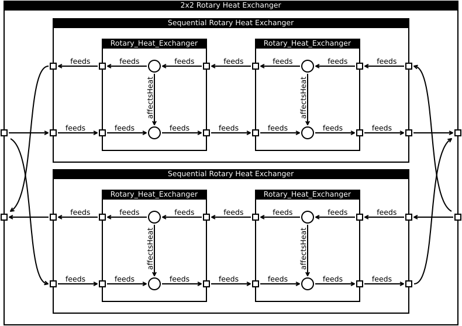

# Demonstration

## Group Toolchain

The [generate_group](../src/generate_group) script produces the definitions needed for defining groups. The result is stored as `brick_group.ttl`. The In the following we will see a series of instantiations of such groups using [/src/group.py](../src/group.py).

## Rotary Heat Exchanger

The [generate_rotary_heat_exchanger](../src/generate_rotary_heat_exchanger) script uses the `brick_group.ttl` definitions to define a rotary heat exchanger:

## Rotary Heat Exchanger Sequence

The [generate_seq_rotary_heat_exchanger](../src/generate_seq_rotary_heat_exchanger) script builds on this to instantiate two rotary heat exchangers and connect them in sequence:

**Note:** The labeling of ports has been omitted due to space constraints.

## 2x2 Rotary Heat Exchanger Setup

The [generate_tbt_rotary_heat_exchanger](../src/generate_tbt_rotary_heat_exchanger) script builds on this to instantiate two of these constructs and connect them in parallel:

**Note:** The labeling of ports has been omitted due to space constraints.

## Demo Setup

The [generate_demo_setup](../src/generate_demo_setup) script builds on this to instantiate one of these constructs and connect a selection of sensors to its ports:

**Note:** Input and output ports of the outer group have been flipped compared to the previous figures. The mapping is:

* **Primary Input** is a `Temperature_Sensor`
* **Primary Output** is a `Humidity_Sensor`
* **Secondary Input** is a `Pressure_Sensor`
* **Secondary Output** is a `Flow_Sensor`

Neested in the figure are three layers of blocks, each of a different type defined in a separate file. The nesting is (color coded for type):

## Results

The [demo](../src/demo) script executes a series of queries on the resulting model. These includes

* *Case 1 - sensors which are fed by a temperature sensor* This shows that it is trivial to traverse nested groups without risking spillage
* *Case 2 - labels of groups which are fed by a temperature sensor* This shows that is is simple to find encompassing groups
* *Case 3 - which sensors affects the flow sensor* This illustrates the *affects* relation which is used to link the two sides of the rotary heat exchanger
* *Case 4 - find rotary heat exchangers in sequence* This provides evidence that the grouping works
* *Case 5 - find rotary heat exchangers in parallel* This provides evidence that the grouping works. **Note:** This query is quite slow and produces 16 matches (one for every 8 combinations and the mirrored representations of these)

## Lessons Learned

[RDFLib](https://github.com/RDFLib/rdflib) can be very slow and at times messy:

* The number of relations in this demo grew faster than necessary. I might have missed some cleanup functionality though.
* I failed to successfully insert an isLiteral FILTER into a SparQL query. Maybe it is simply not supported?
* Some queries fail on Python 3.5. Going back to 2.7 solves the problem.

