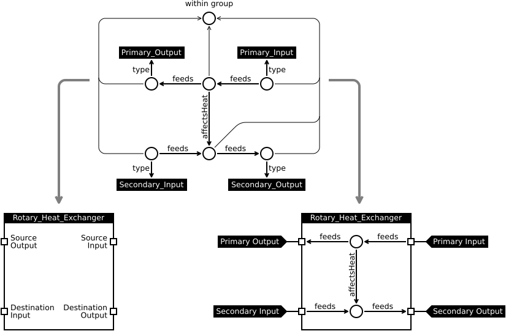

# Context

<!-- what do we hope to accomplish with this? -->
This is intended to be a proof-of-concept implementation of a grouping mechanism for [Brick](http://brickschema.org) that allows for composition.

<!-- function block disclaimer: this is a group -->
Due to the foggy definition of a function block (or functional block or block or to a lesser degree subgraph) I have elected to call this a *group* to avoid confusion. Hopefully without generating too much confusion. That name happens to mirror its functionality; it groups a subgraph. On the subgraph boundary a set of *ports* define its interface.

<!-- what is a group: subgraph, one entity to rule them all, interface through ports -->
The group can be derived by the following process:

1. Start with an RDF graph
2. Draw a circle encompassing the subgraph targeted for grouping
3. Create a group entity (aka node)
4. Make sure every entity within the circle has a `within*` path to the group entity
5. Ports are placed on the edge of the circle wherever en edge crosses it
6. Each edge crossing a port is split in two
7. Every port has a within edge to the group entity

**Note:** Ports may be reused to account for fanout or -in.

# Problem

The question then becomes, how can we create such a group instance from a group template?

# Approach

## Group Template

The group template should fundamentally be a Brick model. The set of ports belonging to an outer group (a group which is not part of another group) defines the interface. These ports are entities with a type which is a unique (within the group) subclass of `Port`. This allows us to name them individually. Similarly group types are subclasses of `Group`.

## Group Instance

Given a graph template, generating a corresponding graph instance is the matter of:

1. Make sure all type definitions of the template graph exist in the destination graph
2. Clone instance entities from template graph to destination graph, including
  * Maintain a mapping from source instances to destination instances
3. Clone relations from template graph to destination graph using map
4. Exposing the outer ports for composition

# Example

A rotary heat exchanger is a device which transfers heat (but not matter) between two flows of air. It does so by sending both through a rotating barrel with a large surface and and a high heat conductivity (think of a barrel filled up with copper pipes). How do we model this is Brick?


In order to differentiate the two flows we would have to subclass these flow relations. This (i) moves the problem to the relations, (ii) exposes the complexities of the solution to the users, and (iii) makes it harder to write queries (having to differentiate between `feedsReturn` and `feedsSupply`). What happens if we use a two-node setup where each node represents a distinct flow and a relation between them specifies how one affects the other?


This relation integrates significantly better with SparQL (and similar querying languages) as one can find anything being thermically affected by `?heater` by the triplet pattern `?heater (feeds|affectsHeat)+ ?thing`. However, device is now represented by two entities and one relation; there is no single entity for referencing the device.

In addition to solving this, the group also allows us to operate at a higher level of abstraction.


At first this seems like a lot of complexity. The entity count goes from two to eleven. What do we gain from increasing this complexity? It allows us to name a port of a group:

```sparql
SELECT ?port ?group
WHERE {
    ?port rdf:type/rdfs:subClassOf rhx:Primary_Input .
    ?port grp:within ?group
}

```

This in turn provides us with the fundamentals for reasoning about subgraphs and their interactions.



At this point the subgraph can be seen as a block with an interface separating use from implementation. In short, it allows us to compose our graph (or subgraph) at block-level granularity.

## Open Questions

### Port Direction

Does a port have a direction? So far I have not come across a strict *need* for direction. Conceptually, it might make sense to restrict the direction. On the other hand, it would complicate things a bit on the lower abstraction.

### Port Type

Does a port have a type? It would make conceptual sense to assign both direction and type to ports. A `Boiler` block would then have a `Water Input` and a `Steam Output`.

### Interface Matching

This form of grouping gives us strict nesting, meaning that the all paths between something inside the group and something outside the group goes through a port of that group. This complicates things when it comes to interface matching.

* If interface matching is a wrapper around group matching then we find ourselves facing something very close to the classical inherited type equivalence problem. There are solutions to this, but how would a concrete solution look? and how would it affect the complexity of queries?
* One alternative is that a group can *provide* an interface. This has the benefit of introducing the notion of an interface.

### The Evolving Graph

**Note:** This is not specific to grouping.

As the building change so should the model. However, once the model has changed data collected prior to the time of change no longer has a representation in that model.

A few solutions:
1. Store the model in some versioning control system. While this would strictly speaking work it would be cumbersome to do queries over time.
2. Annotate every entity in our model with two timestamps: `valid_from` and `valid_to`. This way it is trivial to extract a subgraph representing to state of the building at any point in time. For practical reasons tools would need to be created to maintain this:
  * When inserting a new entity it is assigned a `valid_from` timestamp and a `valid_to`null object.
  * When removing an entity it is actually kept, but marked as currently invalid by assigning a timestamp to its `valid_to` field.

